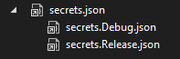

# Chrysalit.Extensions.UserSecrets

This package provide extensions methods for the well-known [Microsoft.Extensions.Configuration.UserSecrets](https://www.nuget.org/packages/Microsoft.Extensions.Configuration.UserSecrets/) package available from the [dotnet runtime](https://github.com/dotnet/runtime).

Globally the source code is very similar, but the sole purpose is to provide capability to manage "environmental" secrets (i.e. `secrets.{env}.json`) the same way it is already done with `appsettings.json` and the associated environemental file `appsettings.Development.json` in the various samples provided.

This package use the `IHostEnvironment` configuration defined on the `IHost`.
See [examples](#examples) for a quick overview. 


# Original Problem

It is common that applications are deployed on several environments.
And it is not uncommon willing to debug an application on several environments, whatever during an active development phase, to access production-grade data quality, debug a specific issue ...

While [Microsoft.Extensions.Configuration.UserSecrets](https://www.nuget.org/packages/Microsoft.Extensions.Configuration.UserSecrets/) is adviced for the developper experience, switching secrets from an environment to another is not straightforward.

As developers, committing "secrets" in sources control system (SCM/Git) is not recommended, and in the same time having the capability to quickly launch an application for several environments with different connections strings, API passwords and so on ... would be helpful.

By default [Microsoft.Extensions.Configuration.UserSecrets](https://www.nuget.org/packages/Microsoft.Extensions.Configuration.UserSecrets/) use only one "secrets.json" file, even if it stored in a dedicated folder with the name of `Guid` of the `UserSecretsId` property.


# Solution

The changes provided in this package are so simple that it could be proposed as a PR on the official Dotnet Runtime repository.


# Installation 

## Nuget

The package is available on [Nuget](https://www.nuget.org/packages/Chrysalit.Extensions.UserSecrets/).

```csharp
dotnet add package Chrysalit.Extensions.UserSecrets
```

# Examples

Examples provide various stategy to define an "environment" that will be used by the new extensions methods introduced in this package to load the secret files in order:
- secrets.json
- secrets.dev.json

## Using UserSecrets

The recommended approach is to use the `MSBuild` property which is automatically generated and defined in your project `.csproj` file when installing [Microsoft.Extensions.Configuration.UserSecrets](https://www.nuget.org/packages/Microsoft.Extensions.Configuration.UserSecrets/) Nuget package.

### MSBuild Property

Define the `UserSecretsId` with a new generated `Guid` value in the `.csproj` file:
```
  <PropertyGroup>
    <UserSecretsId>d56b659d-5c1e-4b9d-a90f-517cdf0ed624</UserSecretsId>
  </PropertyGroup>
```

### Assembly

Define the `UserSecretsId` as attribute of your `namespace`:
```csharp
[assembly: UserSecretsId("d56b659d-5c1e-4b9d-a90f-517cdf0ed624")]
namespace Sample {
  // omitted for brievety
}
```

## Nuget Packages and using statements

The examples below uses the following Nuget packages:

- Microsoft.Extensions.Configuration
- Microsoft.Extensions.Configuration.UserSecrets
- Microsoft.Extensions.Hosting
- Chrysalit.Extensions.UserSecrets

All examples below requires the following `using` statements:
```csharp
using Chrysalit.Extensions.UserSecrets;
using Microsoft.Extensions.Configuration;
using Microsoft.Extensions.Hosting;
```

## Host.CreateDefaultBuilder()

For this example the `dev` environment is explicitely declared.
Order doesn't matter, `UseEnvironment` may be declared after `ConfigureAppConfiguration`.

```csharp
var host = Host.CreateDefaultBuilder(args)
    .UseEnvironment("dev")
    .ConfigureAppConfiguration((context, config) =>
    {
        config.AddUserSecrets<Program>(context);
    })
    .Build();
```

`context` is a `HostBuildContext` object.
By default the `CreateDefaultBuilder` will load the default `secrets.json` file.
But our new `config.AddUserSecrets<Program>(context)` will load the `secrets.dev.json` file and overwrite configuration values.

## AddInMemoryCollection()

Note that `ConfigureHostConfiguration` delegate is called before `ConfigureAppConfiguration` delegate.
Methods may be declared in any order but this one is better for clarity.

```csharp
var host = new HostBuilder()
    .ConfigureHostConfiguration(config =>
    {
        config.AddInMemoryCollection(
        [
            new KeyValuePair<string, string?>(HostDefaults.EnvironmentKey, "dev")
        ]);
    })
    .ConfigureAppConfiguration((context, config) =>
    {
        config.AddUserSecrets<Program>(context);
    })
    .Build();
```

# AddEnvironmentVariables()

Configure your application to use the `DOTNET_ENVIRONMENT` environment variable.

```csharp
var host = new HostBuilder()
    .ConfigureHostConfiguration(config =>
    {
        config.AddEnvironmentVariables("DOTNET_");
    })
    .ConfigureAppConfiguration((context, config) =>
    {
        config.AddUserSecrets<Program>(context);
    })
    .Build();
```

## Command

Configure your application to use the
`--environment dev`

```csharp
var host = new HostBuilder()
    .ConfigureHostConfiguration(config =>
    {
        config.AddCommandLine(args);
    })
    .ConfigureAppConfiguration((context, config) =>
    {
        config.AddUserSecrets<Program>(context);
    })
    .Build();
```

## From Configuration (appsettings.json)

Content of the "appsettings.json" file: 
```json
{
  "environment": "dev"
}
```

Code
```csharp
var host = new HostBuilder()
    .ConfigureHostConfiguration(config =>
    {
        config.AddJsonFile("appsettings.json")
    })
    .ConfigureAppConfiguration((context, config) =>
    {
        config.AddUserSecrets<Program>(context);
    })
    .Build();
```


## Example lauchprofile.json

This `launchSettings.json` provides debug configurations for the examples above.

```json
{
  "profiles": {
    "Debug Default": {
      "commandName": "Project"
    },
    "Debug Environment Variable": {
      "commandName": "Project",
      "environmentVariables": {
        "DOTNET_ENVIRONMENT": "dev"
      }
    },
    "Debug CommandLine Args": {
      "commandName": "Project"
      "commandLineArgs": "--environment dev",
    }
  }
}
```

# Managing Environment UserSecrets

While this package provide the capability to load "environment" secrets at runtime, management of these various secrets files is not as straighforward it should be.

The following sections provide some hints.

## Integration with SlowCheetah VS Extension

SlowCheetah is a VS Extension that allow powerful transformation on configuration files.

When combining SlowCheetah with the [From Configuration](#from-configuration-appsettingsjson), it becomes easier to define the environment key in `appsettings.{environment}.json` files, and uses this package to load the associated `secrets.{environment}.json` file.

`appsettings.json` is transformed and available in the output when building the project, while `secrets.{environment}.json` is only loaded at runtime depending of the value of the `enviroment` configuration key.

The only issue is that it is not straitforward to manage environments secrets directly from the `Solution Explorer` in Visual Studio.

While it is possible to configure `secrets.json` files to be available in the project, managing `secrets.json` using `SlowCheetah` can add transormations automatically but there's somme caveats:

- transformations files created are added with a relative path to the project `.csproj` file.
- `secrets.json` is output to the build directory.


## dotnet user-secrets limits

Interestingly, the [dotnet tool user-secrets](https://github.com/dotnet/aspnetcore/tree/main/src/Tools/dotnet-user-secrets) has an option to specify a MSBuild configuration but this option is useless. The `secrets.json` file is always used.

```cmd
dotnet user-secrets --configuration Release --verbose set "apikey" "123456"
```

The `--verbose` displays the path of the `secrets.json` file being modified.

## MSBuild Configuration

One of the best method may be to diplay the `secrets.json` and associated `secrets.{environment}.json` in the `Solution Explorer`. This does allow:

- Display secrets files associated with the build configuration
- secrets.json is not output to the build directory.

Adding a new `environment` secret file is not well integrated (by example when adding a custom build configuration), but editing the project `.csproj` file seems mandatory in any case.

```
  <PropertyGroup>
    <SecretPath Condition="$([MSBuild]::IsOSPlatform('Windows'))">$(AppData)\Microsoft\UserSecrets\$(UserSecretsId)\</SecretPath>
    <SecretPath Condition="!$([MSBuild]::IsOSPlatform('Windows'))">$(Home)/.microsoft/usersecrets/$(UserSecretsId)/</SecretPath>
  </PropertyGroup>
	
  <ItemGroup>
	<None Include="$(SecretPath)secrets.json"/>
	<None Include="$(SecretPath)secrets.Release.json">
	  <DependentUpon>secrets.json</DependentUpon>
	</None>
	<None Include="$(SecretPath)secrets.Debug.json">
      <DependentUpon>secrets.json</DependentUpon>
	</None>
  </ItemGroup>
```

The result is displayed below:

[](https://github.com/CHRYSALIT/Extensions.UserSecrets/blob/92c8449d439859d7ca37b927577f326ce943b096/docs/assets/VSSolutionExplorerSecrets.png)

More information about this [MSBuild configuration](MSBuild.md) is provided for information.

